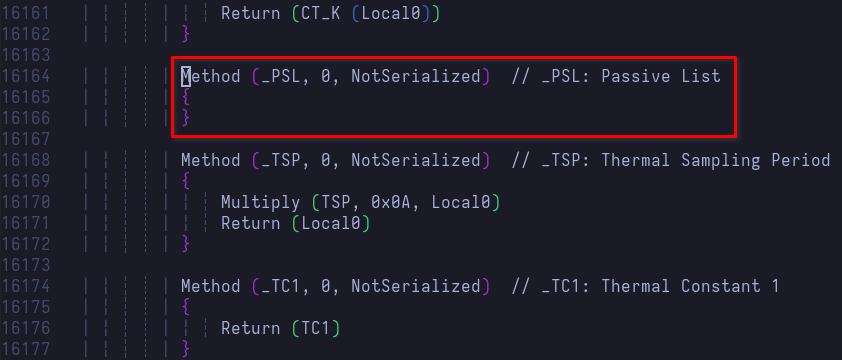

# Analyzing ACPI tables

## Dumping, extracting, and disassembling ACPI tables

First things first: we need to identify the compiler version. This is going to ensure more successful [dis]assembly. We are mostly interested in DSDT and SSDT, so we'll be looking specifically for those
```sh
$ dmesg -t | egrep 'ACPI: (DSDT|SSDT)'
ACPI: DSDT 0x00000000BD6F2218 013DD0 (v02 _ASUS_ Notebook 01072009 INTL 20120913)
ACPI: SSDT 0x00000000BD7062C8 005419 (v02 AMD    AmdTable 00000002 MSFT 02000002)
ACPI: SSDT 0x00000000BD718F00 00119C (v01 AMD    AMD CPU  00000001 AMD  00000001)
ACPI: SSDT 0x00000000BD71A8E0 000C33 (v01 AMD    AmdTable 00000001 INTL 20120913)
ACPI: SSDT 0x00000000BD71B518 0010AC (v01 AMD    AmdTable 00000001 INTL 20120913)
ACPI: SSDT 0x00000000BD71C5C8 001A15 (v01 AMD    CPMD3CLD 00000001 INTL 20120913)
ACPI: SSDT 0x00000000BD71DFE0 0002AA (v01 AMD    AmdTable 00000001 INTL 20120913)
ACPI: SSDT 0x00000000BD71E290 001C69 (v01 AMD    AmdTable 00000001 INTL 20120913)
```

The compiler version is the last field in the output following the Compiler Name (e.g. AMD, INTL, MSFT). In our case, the compiler version is `20120913`[^1] (yes, that is the date 2012-09-13), and this is important because we are going to build[^2] that specific version to disassemble and compile the tables. Considering the fact that this was compiled in 2012, we may need to use an older container to successfully build that release. I used an Ubuntu Xenial container using `systemd-nspawn` with the build dependencies installed. Note that we won't be _installing_ tools; we'll build and use them in-place as we don't want any conflicts after having installed the latest release of `acpica-tools` from the package repos

Assuming we've already downloaded the source tarball and built it, let's begin by dumping ACPI using the system-wide install of ACPICA, extracting the binary tables , then disassembling them using the 2012 release we built. Switching between the container and host system is implied, as well as moving files between both. For instance, I built ACPICA release 2012 in the container, and copied the release binaries (only really interested in `iasl`; `make iasl`) back to my host so I don't have to keep switching between the two. The following assumes the current working directory to be `~/stock_acpi/` on the host, where the compiled binaries had been copied

```sh
# Copy iasl from the container into the current working directory
$ sudo cp /var/lib/machines/compiler/root/acpica-unix-20120913/generate/unix/bin64/iasl .
# Dump ACPI to the output file acpidump
$ sudo acpidump > acpidump
# Extract DSDT/SSDT
$ acpixtract acpidump

Intel ACPI Component Architecture
ACPI Binary Table Extraction Utility version 20230628
Copyright (c) 2000 - 2023 Intel Corporation

  DSDT -   81360 bytes written (0x00013DD0) - dsdt.dat
  SSDT -    4268 bytes written (0x000010AC) - ssdt1.dat
  SSDT -    4508 bytes written (0x0000119C) - ssdt2.dat
  SSDT -    7273 bytes written (0x00001C69) - ssdt3.dat
  SSDT -    6677 bytes written (0x00001A15) - ssdt4.dat
  SSDT -    3123 bytes written (0x00000C33) - ssdt5.dat
  SSDT -   21529 bytes written (0x00005419) - ssdt6.dat
  SSDT -     682 bytes written (0x000002AA) - ssdt7.dat
```

We will break here for a quick interjection:

> ~~I’d just like to interject for a moment. What you’re refering to as Linux, is in fact, GNU/Linux, or as I’ve recently taken to calling it, GNU plus Linux.~~

ACPI tables can have external references. Much like how you can modularize your code to be split over multiple files, ACPI tables can be like this too. For successful disassembly, we need to instruct the disassembler to include _other_ tables for external symbol resolution

```sh
# Prepare SSDT file names to be passed as args to iasl -e <tables> -d dsdt.dat
$ ls | grep ssdt | tr '\n' ',' && echo
ssdt1.dat,ssdt2.dat,ssdt3.dat,ssdt4.dat,ssdt5.dat,ssdt6.dat,ssdt7.dat,
# Disassemble DSDT, including external symbols found in SSDT
$ ./iasl -e ssdt1.dat,ssdt2.dat,ssdt3.dat,ssdt4.dat,ssdt5.dat,ssdt6.dat,ssdt7.dat -d dsdt.dat
......
Parsing completed
Disassembly completed
ASL Output:    dsdt.dsl - 651790 bytes
# Disassemble SSDT[1-7], including external symbols found in SSDT[1-7]
$ for ssdt in $(ls | grep ssdt); do ./iasl -e ssdt1.dat,ssdt2.dat,ssdt3.dat,ssdt4.dat,ssdt5.dat,ssdt6.dat,ssdt7.dat -d $ssdt; done
......
Parsing completed
Disassembly completed
ASL Output:    ssdt7.dsl - 5219 bytes
$ ls | grep dsl
dsdt.dsl
ssdt1.dsl
ssdt2.dsl
ssdt3.dsl
ssdt4.dsl
ssdt5.dsl
ssdt6.dsl
ssdt7.dsl
```

Et voilà! We have successfully disassembled DSDT/SSDT. We can finally move on to the real deal

## Inspecting DSDT

In this section, we will be focusing primarily on the PSL control method. At this point, we have two options:

1. Manual inspection: Inspecting ASL code using an editor, and looking for specific methods using `grep`
2. Assisted inspection: Using `acpiexec` to load tables, dump all their methods at once, and even debugging them

### 1. Manual inspection

Recall the warning from earlier?

```
ACPI Warning: \_TZ.THRM._PSL: Return Package type mismatch at index 0 - found Integer, expected Reference (20230331/nspredef-260)
```

Remember how we also mentioned that filtering the kernel ring buffer based on message level may end up hiding important context? Let's have a second look at the above warning in the context of event chronology. We are preserving timestamps here as they provide important context as well

```sh
$ dmesg | grep -i acpi
[1.308440] ACPI Warning: \_TZ.THRM._PSL: Return Package type mismatch at index 0 - found Integer, expected Reference (20230331/nspredef-260)
[1.308450] ACPI: \_TZ_.THRM: Invalid passive threshold
[1.332434] ACPI: thermal: Thermal Zone [THRM] (73 C)
```

Previously, that second line was not included because we'd chosen to show only warnings and errors, whereas that message level is `info`. Moreover, noticing the timestamps, we can tell that shortly after the warning was emitted, the thermal zone `THRM` complained about an invalid passive threshold. What does that mean?

This is where the ACPI specification[^3] is a must-have. For the sake of brevity, I will summarize the concept. Thermal control in ACPI boils down to 3 policies: active, passive, and critical. Active cooling is achieved by turning on the fan device(s) to actively cool the system. Passive cooling is achieved by clock throttling. The upside to passive cooling is little-to-no noise (fan device(s) should spin at the minimum RPM they support, or turn off altogether), and less power consumption (i.e. power saving). The downside, however, is the performance impact that's a result of throttling. Finally, and <u style="color:red">***most importantly***</u>, the critical policy. As the name suggests, this policy activates when the thermal zone reaches the critical temperature trip point, immediately shutting down the system to avoid hardware damage. This policy we will avoid messing with at all costs because, if not handled properly, we can literally fry the device beyond repair

Now that we got the concepts out of the way, let's focus on passive cooling, specifically the `\_TZ.THRM._PSL` control method; the **T**hermal **Z**one `THRM`'s **P**a**s**sive **L**ist. This thermal object is what evaluates to a list of processor objects to be used for passive cooling[^4]. We'll start by grepping for `_PSL` in `dsdt.dsl`, or searching for it using the editor of choice

```sh
$ grep -n _PSL dsdt.dsl
16164:            Method (_PSL, 0, NotSerialized)  // _PSL: Passive List
```

We can see that iASL has already very graciously annotated the object for us. Let's open the file at the line number returned and take a look at the method in question

```sh
$ vim dsdt.dsl +16164
```

Lo and behold! We've got ourselves a \*_checks notes_\* useless stub method. Well, it's not exactly "useless", per se, since `_PSV` is also defined[^5]



Looking back at the warning, it makes sense now. Stub method would return "nothing" or UnknownObj. What we need to figure out now is how we can get this method to evaluate to a package containing references to all processor objects to be used for passive cooling. We are going to do this in the next subchapter

### 2. Assisted inspection

We'll take this brief detour to check out what `acpiexec` can offer. First off, `acpiexec` works with compiled AML (**A**CPI **M**achine **L**anguage) tables, so let's go ahead and compile DSDT using the latest release of `iasl`, followed by loading the compiled AML table into `acpiexec`

```sh
# Compile DSDT
$ iasl dsdt.dsl
......
ASL Input:     dsdt.dsl -  651790 bytes   8601 keywords      0 source lines
AML Output:    dsdt.aml -   81446 bytes   6414 opcodes    2187 named objects

Compilation successful. 0 Errors, 73 Warnings, 391 Remarks, 129 Optimizations, 3 Constants Folded
# Load DSDT into acpiexec, disabling execution of STA/INI methods during init
$ acpiexec -di dsdt.aml
......
ACPI: Enabled 1 GPEs in block 00 to 7F
- find _PSL
    \_TZ.THRM._PSL Method       0x55e15e8614d0 001 Args 0 Len 0000 Aml 0x55e15e7c85f2
- disassemble \_TZ.THRM._PSL
{
- quit
```

What happened there? What is with the `{`? Well, thing about `acpiexec` is that it will not show you the full code driving a control method, so you won't be seeing `Method (...)` for starters. Additionally, if the control method really is just a stub, there will be nothing to show. Where the program really shines, however, is for quick debugging and finding methods on the fly. This can be useful if you want to test certain changes before upgrading the tables and rebooting the system. From this point on, however, we will mostly rely on manual inspection since we can get the full picture better that way

[^1]: [ACPICA release 20120903](https://www.intel.com/content/www/us/en/download/774413/774454/acpi-component-architecture-downloads-previous-releases-2012.html)

[^2]: [ACPICA build instructions](https://www.intel.com/content/www/us/en/developer/topic-technology/open/acpica/download.html)

[^3]: [Thermal Management](https://uefi.org/specs/ACPI/6.5/11_Thermal_Management.html)

[^4]: [_PSL (Passive List)](https://uefi.org/specs/ACPI/6.5/11_Thermal_Management.html#psl-passive-list)

[^5]: [Thermal Zone Interface Requirements](https://uefi.org/specs/ACPI/6.5/11_Thermal_Management.html#thermal-zone-interface-requirements)
