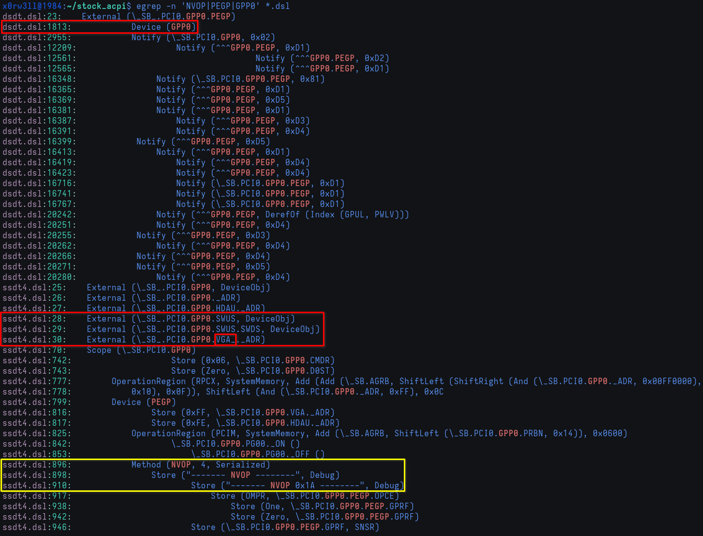
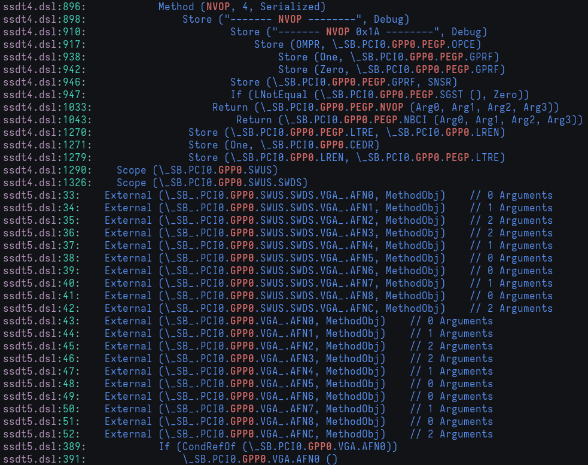

# Addressing Nouveau

Welcome to the final leg of this tour: addressing a non-issue. No, really; this part has absolutely no effect other than simply getting rid of a warning message. _However_, there's a bit of learning involved, and a chance to patch a kernel driver, which is the entire point of this research

Quick refresher, as usual

```
ACPI Warning: \_SB.PCI0.GPP0.PEGP._DSM: Argument #4 type mismatch - Found [Buffer], ACPI requires [Package] (20230628/nsarguments-61)
```

This warning message on its own probably doesn't mean much or make any sense right off the bat, save for the fact that there's an issue with the PEGP **D**evice-**S**pecific **M**ethod. Now that we have `ACPI_DEBUG*` kernel configs in place, we _also_ get some much needed context, and it's the following output

```
ACPI Debug:  "------- NVOP --------"
ACPI Debug:  "------- NVOP --------"
ACPI Debug:  "------- NVOP 0x1A --------"
```

Again, both outputs might not make sense when viewed individually. Put together, however, and we have a bit more specificity and pointers as to what might be happening. Let's find out whether or not they're related by grepping `*.dsl` for either `PEGP`, `NVOP`, `GPP0`, or all of them



If we scroll down just a bit more, we'll have additional context



```
ssdt4.dsl:1033:     Return (\_SB.PCI0.GPP0.PEGP.NVOP (Arg0, Arg1, Arg2, Arg3))
```

Now we know that the we need to look into the 4th SSDT for the `PEGP` Device declaration, along with its two control methods of most relevance to us; `_DSM` and `NVOP`. Additionally, the `GPP0` device seems to have VGA-related control methods, so that means that it's responsible for handling VGA controller, of which this laptop has two; NVIDIA and AMD. If we were to guess that it might have anything to do with **NV**IDIA, we'd be correct in guessing that. By default, Linux will use the Nouveau driver to handle NVIDIA cards, and this is exactly where we'll start our search.

As usual, `git grep nouveau` will show us everything we need. GPU driver source files are found in `drivers/gpu/drm/{nouveau,amd}`, so let's go ahead and see what's inside the `nouveau` directory

```sh
$ ls drivers/gpu/drm/nouveau/
dispnv04             nouveau_bo.o         nouveau_gem.o       nouveau_ttm.h
dispnv50             nouveau_chan.c       nouveau_hwmon.c     nouveau_ttm.o
include              nouveau_chan.h       nouveau_hwmon.h     nouveau_usif.c
Kbuild               nouveau_chan.o       nouveau_hwmon.o     nouveau_usif.h
Kconfig              nouveau_connector.c  nouveau_ioc32.c     nouveau_usif.o
modules.order        nouveau_connector.h  nouveau_ioc32.o     nouveau_uvmm.c
nouveau_abi16.c      nouveau_connector.o  nouveau_ioctl.h     nouveau_uvmm.h
nouveau_abi16.h      nouveau_crtc.h       nouveau.ko          nouveau_uvmm.o
nouveau_abi16.o      nouveau_debugfs.c    nouveau_led.c       nouveau_vga.c
nouveau_acpi.c       nouveau_debugfs.h    nouveau_led.h       nouveau_vga.h
nouveau_acpi.h       nouveau_debugfs.o    nouveau_led.o       nouveau_vga.o
nouveau_acpi.o       nouveau_display.c    nouveau_mem.c       nouveau_vmm.c
nouveau_backlight.c  nouveau_display.h    nouveau_mem.h       nouveau_vmm.h
nouveau_backlight.o  nouveau_display.o    nouveau_mem.o       nouveau_vmm.o
...
```

There are many files, but their names are usually descriptive enough. We already know that something's happening on the ACPI side of things that has to do with VGA; the NVIDIA card specifically. It makes sense that we start by looking at `nouveau_acpi.c`

This specific issue is going to be addressed in two parts; one for ACPI, and one for the kernel driver. Both have to be done in order for it to be successfully addressed, so we'll split it accordingly, starting with the kernel driver
