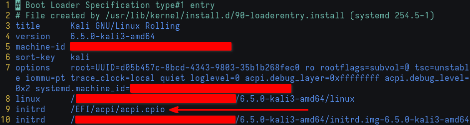

# Addressing _PSL

Let's pull up the `_PSL` control method for a quick refresher

```
Method (_PSL, 0, NotSerialized)  // _PSL: Passive List
{
}
```

## O' Processor, where art thou?

According to the specification[^1], we need to get `_PSL` to return a package of references to processor objects. This evidently implies that we need to _find_ the processor objects to begin with

How can we do that? Simple: by reading the spec! Except, you'll quickly find that there are no references to any `Processor` operators in the language reference. Why is that?

If we take a look at Appendix C: Deprecated Content[^2], we'll find that declaring processor objects has been deprecated in favor of the `Device` operator. Additionally, remember how the compiler version was 20120913? This bit was important in identifying the ACPI specification version used, version 5.0 in our case. If we download the spec PDF, surely enough, the `Processor` operator is there

Additionally, and again according to the spec

> If _PSL is defined then:
> - If a linear performance control register is defined (via either P_BLK or the _PTC, _TSS, _TPC objects) for a processor defined in _PSL or for a processor device in the zone as indicated by _TZM then the _TC1, _TC2, and objects must exist. A_TFP or _TSP object must also be defined if the device requires polling.
> - If a linear performance control register is not defined (via either P_BLK or the _PTC, _TSS, _TPC objects) for a processor defined in _PSL or for a processor device in the zone as indicated by _TZM then the processor must support processor performance states (in other words, the processor’s processor object must include _PCT, _PSS, and _PPC).

Right now, the task is locating said processor objects and making sure they fit either of the requirements outlined above. According to whichever spec version is used, we can consider a list of possible names to search for. For brevity, however, we already have a hint, or an idea, that processor objects were declared in the `\_PR` scope. `Scope` is an ASL operator, so we can begin our search by looking for `Scope (_PR)`

```sh
$ grep -n 'Scope (_PR)' dsdt.dsl
3046:    Scope (_PR)
$ vim dsdt.dsl +3046
```


We can see that this named scope operates on a secondary SSDT, which means we can find processor-related named objects (performance, states, capabilities, dependencies, etc.) in one of the SSDTs we'd already disassembled. Furthermore, scrolling down the `\_PR` scope, we'll find the notation used to be `P[0-9A-F]{3}`. On other hardware, it might be `CPU[0-9]` instead


Now that we know where to look, let's grep away

```sh
$ egrep -n 'P[0-9A-F]{3}' ssdt*.dsl
ssdt2.dsl:22:    External (\_PR_.P000, DeviceObj)
ssdt2.dsl:23:    External (\_PR_.P001, DeviceObj)
ssdt2.dsl:24:    External (\_PR_.P002, DeviceObj)
ssdt2.dsl:25:    External (\_PR_.P003, DeviceObj)
ssdt2.dsl:26:    External (\_PR_.P004, DeviceObj)
ssdt2.dsl:27:    External (\_PR_.P005, DeviceObj)
ssdt2.dsl:28:    External (\_PR_.P006, DeviceObj)
ssdt2.dsl:29:    External (\_PR_.P007, DeviceObj)
```

There we have it! This is an AMD Ryzen 7 3750H processor, and so it makes sense we're getting 8 processor objects shown in the second SSDT

Let's make sure the thermal zone interface requirements are satisfied; each processor object referenced MUST support performance states, namely **P**erformance **C**on**t**rol, **P**erformance **S**upported **S**tates, <u>**and**</u> **P**erformance **P**resent **C**apabilities

Note: AMD Ryzen 7 3750H only meets the latter requirement mentioned at the beginning of this section, and that's why we're looking for those objects specifically

```sh
$ egrep '_P(CT|SS|PC)' ssdt2.dsl
ssdt2.dsl:        Name (_PCT, Package (0x02)  // _PCT: Performance Control
ssdt2.dsl:        Name (_PSS, Package (0x03)  // _PSS: Performance Supported States
ssdt2.dsl:        Method (_PPC, 0, NotSerialized)  // _PPC: Performance Present Capabilites
ssdt2.dsl:        Name (_PCT, Package (0x02)  // _PCT: Performance Control
ssdt2.dsl:        Name (_PSS, Package (0x03)  // _PSS: Performance Supported States
ssdt2.dsl:        Method (_PPC, 0, NotSerialized)  // _PPC: Performance Present Capabilites
ssdt2.dsl:        Name (_PCT, Package (0x02)  // _PCT: Performance Control
ssdt2.dsl:        Name (_PSS, Package (0x03)  // _PSS: Performance Supported States
ssdt2.dsl:        Method (_PPC, 0, NotSerialized)  // _PPC: Performance Present Capabilites
ssdt2.dsl:        Name (_PCT, Package (0x02)  // _PCT: Performance Control
ssdt2.dsl:        Name (_PSS, Package (0x03)  // _PSS: Performance Supported States
ssdt2.dsl:        Method (_PPC, 0, NotSerialized)  // _PPC: Performance Present Capabilites
ssdt2.dsl:        Name (_PCT, Package (0x02)  // _PCT: Performance Control
ssdt2.dsl:        Name (_PSS, Package (0x03)  // _PSS: Performance Supported States
ssdt2.dsl:        Method (_PPC, 0, NotSerialized)  // _PPC: Performance Present Capabilites
ssdt2.dsl:        Name (_PCT, Package (0x02)  // _PCT: Performance Control
ssdt2.dsl:        Name (_PSS, Package (0x03)  // _PSS: Performance Supported States
ssdt2.dsl:        Method (_PPC, 0, NotSerialized)  // _PPC: Performance Present Capabilites
ssdt2.dsl:        Name (_PCT, Package (0x02)  // _PCT: Performance Control
ssdt2.dsl:        Name (_PSS, Package (0x03)  // _PSS: Performance Supported States
ssdt2.dsl:        Method (_PPC, 0, NotSerialized)  // _PPC: Performance Present Capabilites
ssdt2.dsl:        Name (_PCT, Package (0x02)  // _PCT: Performance Control
ssdt2.dsl:        Name (_PSS, Package (0x03)  // _PSS: Performance Supported States
ssdt2.dsl:        Method (_PPC, 0, NotSerialized)  // _PPC: Performance Present Capabilites
```

With that knowledge in mind, let's put it to good use

## To Method, or not to Method, that is the question

We need to pause for a second. In the original table, `_PSL` is defined as a control method, and I'd been referring to it as such for consistency. However, we need to understand that control method declaration entails a set of things. Where a list of references to processor objects is concerned, do we need an entire control method along with its 8 automatically available local variables? Or do we simply need a named object that evaluates to the required list and be done with it?

We do not need any arguments for `_PSL`, so a named object sounds like it makes better sense. Moreover, in the Thermal Zone Examples[^3], the `Name` operator was indeed used, so this is what we'll be going with

## Tracking changes

At this point, it's probably a good idea to consider initializing a local git repo for the `stock_acpi` directory so it's easier to track changes

```sh
# Assuming we're already in ~/stock_acpi
$ git init .
# Since we haven't modified anything yet, track and commit all files
$ git add -A
$ git commit -m 'Added stock ACPI'
```

Whenever we make any changes from this point on, we will provide meaningful commit messages that are easier to look for later. A good commit message convention to follow would probably look like `<SIGNATURE>: \_SCOPE.OBJ.OBJ: <short description>`. For example:

```
DSDT: \_TZ.THRM._PSL: Declared thermal zone THRM's passive list
SSDT2: \_PR.P000: Added missing C-State dependencies
```

More details can be added to the commit message's body to provide context and explanations. Let's go ahead and create our first commit with real work

## Defining \_PSL

We are going to define `_PSL` as a named object using the processor objects previously found in SSDT

```diff
# dsdt.dsl

- Method (_PSL, 0, NotSerialized)  // _PSL: Passive List
- {
- }
+ Name (_PSL, Package (0x08)  // _PSL: Passive List
+ {
+     \_PR.P000,
+     \_PR.P001,
+     \_PR.P002,
+     \_PR.P003,
+     \_PR.P004,
+     \_PR.P005,
+     \_PR.P006,
+     \_PR.P007
+ })
```

Now that we've made a change to the table, we should also bump the DefinitionBlock's OEMRevision; that's the last argument. This is useful for tracking which tables are upgraded, and what the revision is. We could also incorporate this OEMRevision in the commit message so it's easier to track changes across revisions

```diff
- DefinitionBlock ("dsdt.aml", "DSDT", 2, "_ASUS_", "Notebook", 0x01072009)
+ DefinitionBlock ("dsdt.aml", "DSDT", 2, "_ASUS_", "Notebook", 0x01072010)
```

Next, compile the custom table, and commit the changes

```sh
$ iasl dsdt.dsl
$ git add dsdt.dsl dsdt.aml
$ git commit
```


## Upgrading DSDT via initrd

Now that we've ensured successful compilation and committed our changes, it's time to put it to the test. We will be using the kernel documentation[^4] as a guide to upgrade ACPI tables

The explanation to the following steps is outlined in great detail in the docs (link in footnotes)

```sh
$ mkdir -p kernel/firmware/acpi
$ cp dsdt.aml kernel/firmware/acpi
```

For this next step, however, we will be doing things a bit differently

```sh
# Create uncompressed cpio archive
$ find kernel | cpio -H newc --create > acpi.cpio
# Copy the new archive to EFI
$ sudo cp acpi.cpio /boot/efi/EFI/acpi/
```

Since I am using `systemd-boot`, I will pass the `initrd    /EFI/acpi/acpi.cpio` boot param in my image's conf file found at `/boot/efi/loader/entries/<entry-token>-$(uname -r).conf`



Remember how we installed the `acpi` package earlier? We are now going to take note of its output, along with the `dmesg` output pertinent to `_PSL`. We have already seen the latter's warning messages, so let's now focus on what we can see with `acpi`

```sh
# Be verbose
$ acpi -V
Battery 0: Charging, 90%, 00:19:38 until charged
Battery 0: design capacity 4050 mAh, last full capacity 2083 mAh = 51%
Adapter 0: on-line
Thermal 0: ok, 60.0 degrees C
Thermal 0: trip point 0 switches to mode critical at temperature 103.0 degrees C
Cooling 0: Processor 0 of 10
Cooling 1: Processor 0 of 10
Cooling 2: Processor 0 of 10
Cooling 3: Processor 0 of 10
Cooling 4: Processor 0 of 10
Cooling 5: Processor 0 of 10
Cooling 6: Processor 0 of 10
Cooling 7: Processor 0 of 10
```

Right now, there is only 1 trip point defined, and that is the critical trip point. Let's now reboot the system and see if we've had any luck

## Verifying the changes

First things first: we'll look for the kernel buffer ring's messages levels that are above warning to make sure we haven't messed up. We can do this by issuing `dmesg -tl warn+`


Looks promising! We can no longer see the ACPI warning complaining about `_PSL` returning an integer as opposed to a reference. Additionally, if we `dmesg | grep -i acpi`, the thermal zone's `Invalid passive threshold` informational message seems to have disappeared as well!

Let's triple-check what `acpi -V` has to say

```sh
$ acpi -V
Battery 0: Charging, 94%, 00:13:09 until charged
Battery 0: design capacity 4050 mAh, last full capacity 2083 mAh = 51%
Adapter 0: on-line
Thermal 0: ok, 50.0 degrees C
Thermal 0: trip point 0 switches to mode critical at temperature 103.0 degrees C
Thermal 0: trip point 1 switches to mode passive at temperature 96.0 degrees C
Cooling 0: Processor 0 of 10
Cooling 1: Processor 0 of 10
Cooling 2: Processor 0 of 10
Cooling 3: Processor 0 of 10
Cooling 4: Processor 0 of 10
Cooling 5: Processor 0 of 10
Cooling 6: Processor 0 of 10
Cooling 7: Processor 0 of 10
```

And just like that! We can now see _another_ thermal trip point that was previously not there, and it is indeed the passive cooling trip point!

Now, I don't like the fact that it's set to 96 degrees Celsius; that only means that active cooling will be preferred until thermals are at 96 degress. I'd much rather run a fairly silent system, so this is what we'll be looking at next

[^1]: [_PSL (Passive List)](https://uefi.org/specs/ACPI/6.5/11_Thermal_Management.html#psl-passive-list)

[^2]: [Appendix C: Deprecated Content - Section 8.4: Declaring Processors](https://uefi.org/specs/ACPI/6.5/Apx_C_Deprecated_Content.html)

[^3]: [Example: The Basic Thermal Zone](https://uefi.org/specs/ACPI/6.5/11_Thermal_Management.html#example-the-basic-thermal-zone)

[^4]: [Upgrading ACPI tables via initrd](https://www.kernel.org/doc/html/latest/admin-guide/acpi/initrd_table_override.html)
