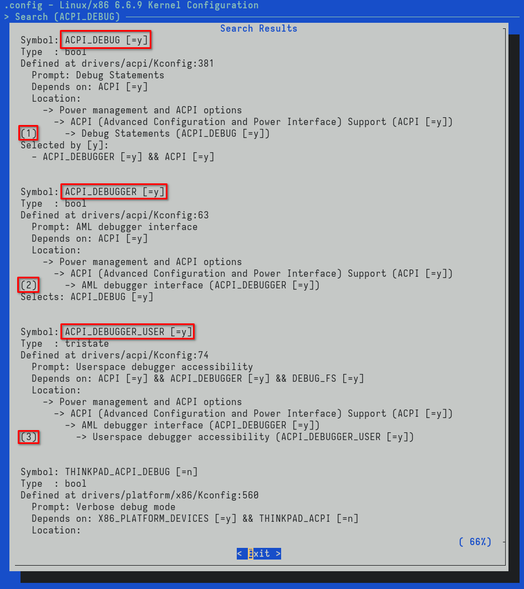
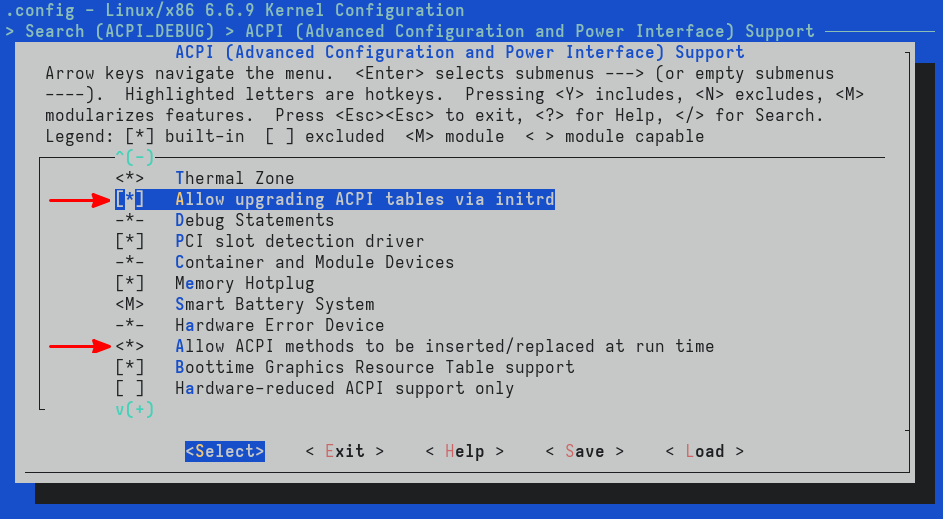
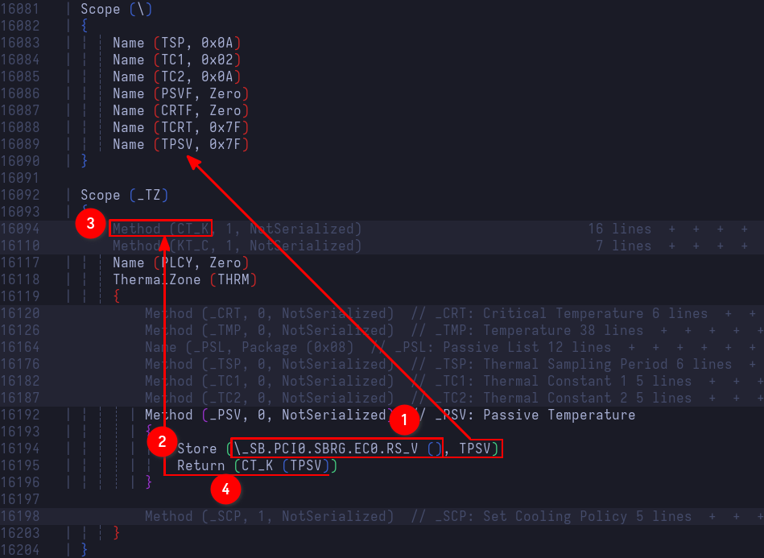
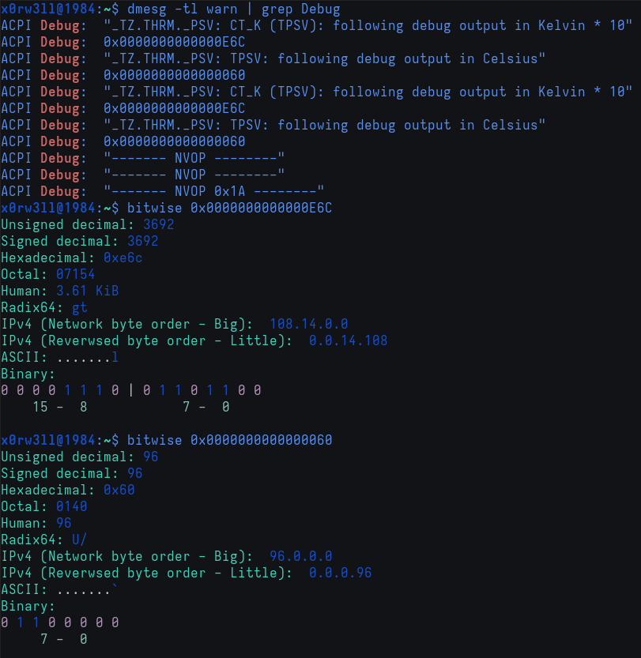
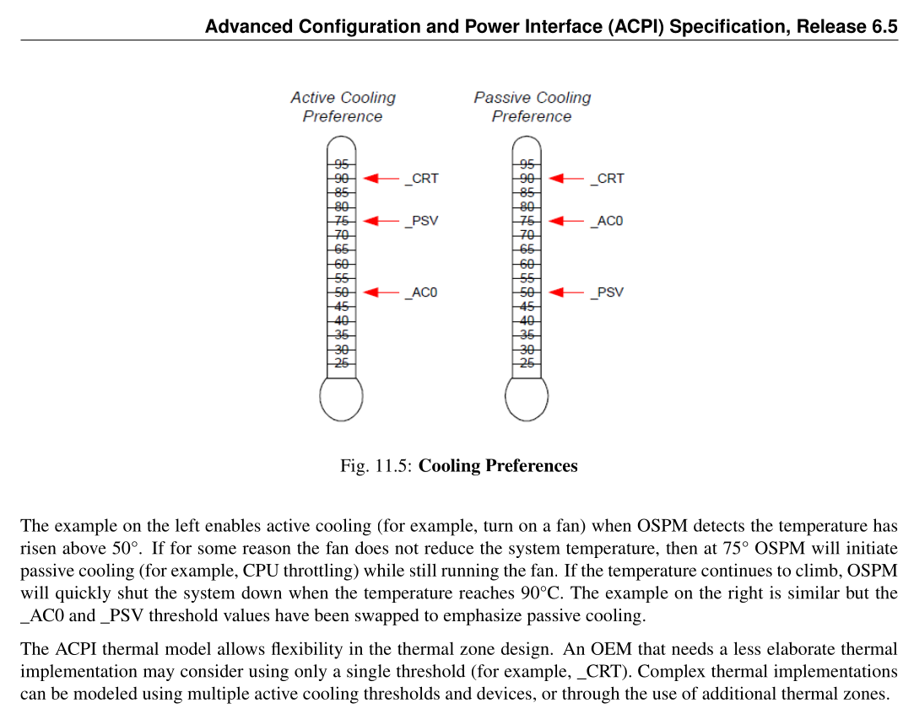
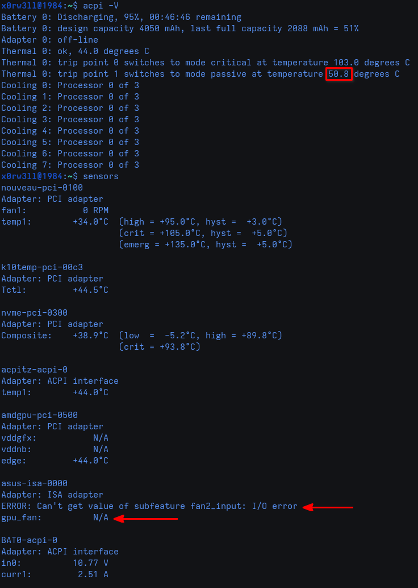

# Addressing _PSV

If you haven't already compiled a custom kernel of your choosing, now is the time to do so. Reason being that we need to build a kernel with `ACPI_DEBUG*` support so we can view debug output in `dmesg`. I cannot stress this enough, but it's going to be better if you clone the repo as opposed to downloading the tarball archive; `git grep` is going to be a lot faster an easier than `grep` when it's needed

As mentioned previously, this writeup assumes prior experience, so I'll skip the full kernel build walkthrough, but opt to only addressing the important bits instead

## Building a custom kernel for ACPI debugging

The most important bit we need is to enable `ACPI_DEBUG*` in the kernel configuration. `make menuconfig`, followed by searching for `ACPI_DEBUG`, should take us right where we need to be. We are going to enable `ACPI_DEBUG`, `ACPI_DEBUGGER`, and `ACPI_DEBUGGER_USER`.



Additionally, we are going to enable two more options

- Allow upgrading ACPI tables via initrd (if not already enabled)
- Allow ACPI methods to be inserted/replaced at run time



We are only interested in bindeb-pkgs so we can save a little time building the kernel. To ensure successfull bootup, don't forget to install the headers package as well

```sh
# Current working directory is assumed to be /path/to/kernel/repo/root/
# Build only the binary deb packages using all processors
$ make -j$(nproc) bindeb-pkg
# Install the new kernel and headers (replace file names with actual pkg names)
$ sudo apt install ../linux-image-x.y.z.deb ../linux-headers-x.y.z.deb
```

Finally, add the `initrd    /EFI/acpi/acpi.cpio` param to the new kernel entry, as well as the following boot params: `acpi.debug_layer=0xffffffff acpi.debug_level=0x2`, and reboot into the newly compiled kernel. Here is what my configuration looks like

```
# Boot Loader Specification type#1 entry
# File created by /usr/lib/kernel/install.d/90-loaderentry.install (systemd 254.5-1)
title      Kali GNU/Linux Rolling
version    6.6.8-nvop-ssdt+
machine-id REDACTED
sort-key   kali
options    root=UUID=d05b457c-8bcd-4343-9803-35b1b268fec0 ro rootflags=subvol=@ tsc=unstabl
e iommu=pt trace_clock=local quiet loglevel=0 acpi.debug_layer=0xffffffff acpi.debug_level=
0x2 systemd.machine_id=REDACTED
linux      /REDACTED/6.6.8-nvop-ssdt+/linux
initrd     /EFI/acpi/acpi.cpio
initrd     /REDACTED/6.6.8-nvop-ssdt+/initrd.img-6.6.8-nvop-ssdt+
```

## Finding passive temperature in DSDT

We already know that the passive temperature is 96 degrees Celcius, but we want to double-check that, and see if there's anything we can do about it. Naturally, we'll `grep -n _PSV dsdt.dsl` and jump straight into the method declaration



The method begins by (1) executing another control method, namely `RS_V`, that belongs to Embedded Controller[^1] 0 (`EC0`), (2) stores its return value in the named object `TPSV` (initialized to 0x7F), and (4) returns the temperature (in <u>Kelvin</u> \* 10) after having passed it (in Celsius) as an argument to the `CT_K` control method (**C**elsius **T**o **K**elvin). Do note that the actual temperature will be in tenth of degrees Kelvin, so for instance, if the returned value from `_PSV` is 3692, the actual temperature will be 369.2 degrees Kelvin, which is precisely 96.05 degress Celsius

Let's go ahead and insert a debug statement to verify the passive temperature. There are two ways to do this

- Using the `Store` operator
- Assigning the value to the `Debug` object directly

We'll use both for demonstration purposes

```asl
Method (_PSV, 0, NotSerialized)  // _PSV: Passive Temperature
{
    Store (\_SB.PCI0.SBRG.EC0.RS_V (), TPSV)
    Store ("\_TZ.THRM._PSV: CT_K (TPSV): following debug output in Kelvin * 10", Debug)
    Debug = CT_K (TPSV) // Return value from \_SB.PCI0.SBRG.EC0.RS_V () is stored in TPSV
    Debug = "\_TZ.THRM._PSV: TPSV: following debug output in Celsius"
    Debug = TPSV
    Return (CT_K (TPSV))
}
```

From this point on, we're assuming bumping the OEMRevision, compiling the modified table, copying it into the `kernel/firmware/acpi` directory, creating the cpio archive, overwriting the previous one in `/boot/efi/EFI/acpi/acpi.cpio`, and committing changes. After that's done and the system's been rebooted, we'll check for warning-level messages since that's where debug output ends up. We can grep for specific filters as well to filter out unwanted messages, but only after we've made sure no new errors/warnings showed up



The output verifies what we've previously seen using `acpi -V`. That is, 3692/10 degrees Kelvin, or 96 degrees Celsius. We needed to see the output coming straight from `_PSV` for two reasons

1. Practicing inserting debug statements
2. Understanding that we are to return the passive temperature in Kelvin, multiplied by 10

I use `bitwise` for quick type conversions, and there's a Vim plugin for it too which can be handy at times. You can install it via `sudo apt install bitwise`

Let's refer back to the specification's cooling preferences[^2] for a second



When the active cooling (`_AC0`) temperature trip point is set lower than the passive cooling (`_PSV`) temperature trip point, active cooling is preferred. That means passive cooling will only be triggered when the temperature exceeds the passive trip point. In our case, the passive temperature is set to 96 degrees Celsius, meaning the fans will always be running, and throttling will only kick in when the temperature exceeds the aforementioned trip point. We want to flip the table here and give preference to passive cooling so the fans can calm the heck down when they're not <u>needed</u>. We also want to try and save up on power consumption. Having always-on fan devices, and processors that are power-hungry, definitely does not help us achieve that goal. The solution is pretty simple at this point: return a lower temperature (50C vs 96C) in tenths of degrees Kelvin. I chose to lower mine down to 50.875[^3] degrees Celsius, or roughly 3240/10 degrees Kelvin

Judging by my own usage, idle/low-power temperatures are at about 40-or-so degrees Celsius, and I don't want my system to run on moderately warm components for too long. I could go for 60 degrees Celsius instead, but I'd rather preserve the components' longevity on the long run than save up on power consumption for the shorter run. Without further ado, let's implement the new change

```diff
$ git diff
diff --git a/dsdt.dsl b/dsdt.dsl
index ac6af92..d31e097 100644
--- a/dsdt.dsl
+++ b/dsdt.dsl
@@ -17,7 +17,7 @@
  *     Compiler Version 0x20120913 (538052883)
  */

-DefinitionBlock ("dsdt.aml", "DSDT", 2, "_ASUS_", "Notebook", 0x01072011)
+DefinitionBlock ("dsdt.aml", "DSDT", 2, "_ASUS_", "Notebook", 0x01072012)
 {
     External (\_SB_.ALIB, MethodObj)    // 2 Arguments
     External (\_SB_.PCI0.GPP0.PEGP)
@@ -16191,12 +16191,16 @@ DefinitionBlock ("dsdt.aml", "DSDT", 2, "_ASUS_", "Notebook", 0x01072011)

             Method (_PSV, 0, NotSerialized)  // _PSV: Passive Temperature
             {
-                Store (\_SB.PCI0.SBRG.EC0.RS_V (), TPSV)
-                Store ("\_TZ.THRM._PSV: CT_K (TPSV): following debug output in Kelvin * 10", Debug)
-                Debug = CT_K (TPSV)
-                Debug = "\_TZ.THRM._PSV: TPSV: following debug output in Celsius"
-                Debug = TPSV
-                Return (CT_K (TPSV))
+                /*  Comment out original values
+                *   We don't need another control method execution
+                *   We can definitely do away with all the unnecessary
+                *   work involved, including the mutex
+                */
+
+                // Store (\_SB.PCI0.SBRG.EC0.RS_V (), TPSV)
+                // Return (CT_K (TPSV))
+
+                Return (0xCA8) // Hex for 3240 (tenths of Kelvin) => 50.85C
             }

             Method (_SCP, 1, NotSerialized)  // _SCP: Set Cooling Policy
```

After rebooting the system, we can finally see that we've successfully overridden the return value from `_PSV`. Now, did we do this correctly? Technically, yes, but also...It's not exactly that simple. For us to do things 100% correctly and properly, we need in-depth knowledge of hardware, ACPI, and experience with systems programming. However, we are not interested in becoming OEMs ourselves—we just want to address whatever issues we can address with what little knowledge and experience we have without causing any additional issues. That logic is obviously not sound as we should always strive to do everything correctly, but let's face it: this is already close enough to our goal, and I'll take it. As far as I'm concerned, and for once, I can't actually hear the fans at all on Linux! Up until this point, regardless of power consumption, my laptop's fans were always on. Doing this, however, gave me the chance to work with a completely silent laptop. There are some caveats that I did not mention: for instance, you'll really experience a "fanless" device when no external displays are involved. When you connect an HDMI cable to an external monitor, there's always more power consumption involved, but I've yet to dive into ACPI in greater detail if I want to look further into this. Maybe I'll revisit it again at a later point in the future when I've had the chance to acquire more knowledge and experience. For now, however, I am very happy with the results so far



[^1]: [ACPI Embedded Controller Interface Specification](https://uefi.org/specs/ACPI/6.5/12_Embedded_Controller_Interface_Specification.html)

[^2]: [Cooling Preferences](https://uefi.org/specs/ACPI/6.5/11_Thermal_Management.html#cooling-preferences)

[^3]: [SB-TSI Temperature and Threshold Encodings](https://www.amd.com/content/dam/amd/en/documents/processor-tech-docs/programmer-references/56255_OSRR.pdf#%5B%7B%22num%22%3A753%2C%22gen%22%3A0%7D%2C%7B%22name%22%3A%22XYZ%22%7D%2C36%2C200.5%2C0%5D)
