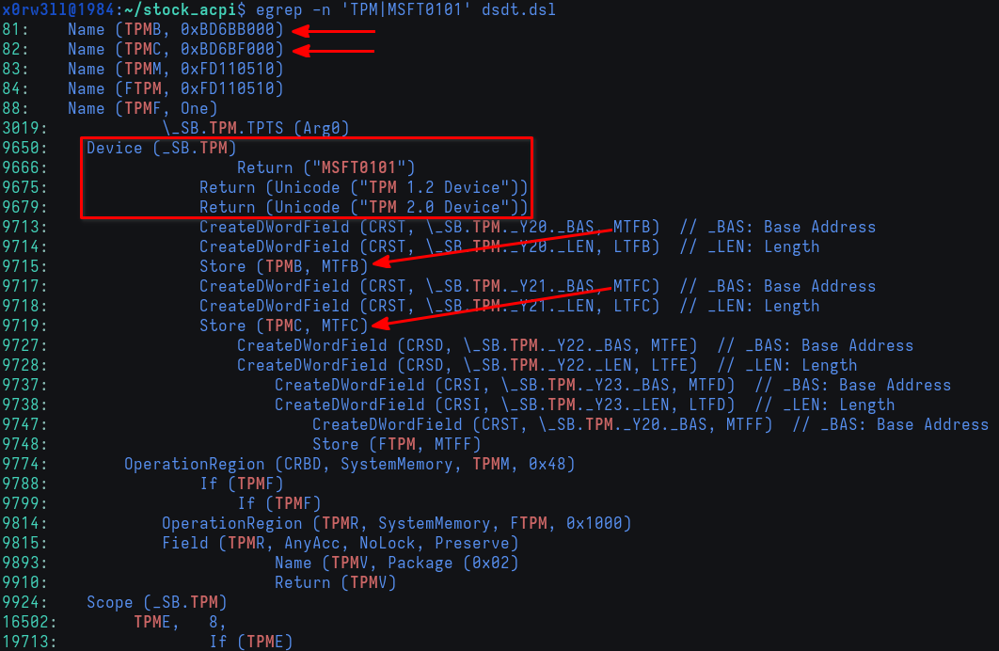

# Addressing TPM

<div class="warning">
Disclaimer: this part is definitely <u>not</u> production-ready. If this is wrong, it can mean serious consequences for your device's security. I merely wanted to get rid of the error just because it annoyed me, but that does not mean that what I've done is necessarily correct. Please be careful messing with security devices if you're not 100% sure of what you're doing. I know I'm probably not 100% sure of what I'm doing, hence this disclaimer, but I don't have a <u>specific, mission-critical</u> use for TPM on Linux at this time so I'm simply choosing to do away with an error. We <em>could</em> simply choose to hide the device error in the driver's source code, but where's the fun in that, amirite?
</div>

Once again, here's a quick refresher on the TPM-related error

```
tpm_crb MSFT0101:00: [Firmware Bug]: ACPI region does not cover the entire command/response buffer. [mem 0xbd6bb000-0xbd6bbfff flags 0x200] vs bd6bb000 4000
tpm_crb MSFT0101:00: [Firmware Bug]: ACPI region does not cover the entire command/response buffer. [mem 0xbd6bf000-0xbd6bffff flags 0x200] vs bd6bf000 4000
```

Right off the bat, we can already get a hint as to why this error came up; there seems to be 1 byte missing (`0xbd6bbfff-0xbd6bb000 = 4095` vs `0xbd6bf000-0xbd6bb000 = 4096`)

Quickest way to find the source file for the driver is to use `git grep` in the kernel's repo. You could either `git grep 'region does not cover'`, or `git grep tpm_crb`. You'll find that the file exists at `drivers/char/tpm/tpm_crb.c`. Let's take a look at the function responsible for displaying this error

```c
/*
 * Work around broken BIOSs that return inconsistent values from the ACPI
 * region vs the registers. Trust the ACPI region. Such broken systems
 * probably cannot send large TPM commands since the buffer will be truncated.
 */
static u64 crb_fixup_cmd_size(struct device *dev, struct resource *io_res,
			      u64 start, u64 size)
{
	if (io_res->start > start || io_res->end < start)
		return size;

	if (start + size - 1 <= io_res->end)
		return size;

	dev_err(dev,
		FW_BUG "ACPI region does not cover the entire command/response buffer. %pr vs %llx %llx\n",
		io_res, start, size);

	return io_res->end - start + 1;
}
```

Let's first talk about what any of this means. `crb` stands for **c**ommand **r**esponse **b**uffer. We interact with the Trusted Platform Module using a medium, if you will, and that is the character device at `/dev/tpmX` (or `/dev/tpmrmX` for TPM 2.0). We send command buffers, and TPM sends back response buffers. The above function checks the IO resources of the TPM device, i.e. start/base address in memory versus limit/end address. Devices declared in ACPI are supplied system resources; be they memory address ranges, I/O ports, interrupts, and/or DMA channels

As we'll soon see, this specific TPM device is allocated two 32-bit memory descriptors, describing fixed ranges of memory addresses; one for the command buffer, and another for the response buffer. Each memory descriptor has a Write status, base address, range length (i.e. total number of bytes decoded in the memory range), and optionally a name for the descriptor[^1]

As mentioned earlier, we could just comment out `dev_err(...)` and call it a day, but we would probably never know how or why ACPI came into play, or understand what actually happened under the hood. Let's find out! We'll do so by grepping DSDT for either `TPM` or `MSFT0101` as per the output shown earlier



As we can see, TPM is a device that's evidently declared in DSDT, and we can already see the memory addresses referenced in the error. What we need to figure out now is making sense of the error in the context of ACPI now that we know where to look

Let's take a closer look at the bits most relevant to our research. I will move a few lines around so it's easier to read, and I'll also provide some additional `/* comments */` besides the compiler-provided `// annotations`

```asl
Name (TPMB, 0xBD6BB000)                                        /* Some memory address for something (more on that later) */
Name (TPMC, 0xBD6BF000)                                        /* Some memory address for another thing (more on that later) */
Name (AMDT, One)                                               /* AMD TPM, probably */
Device (_SB.TPM)                                               /* Device declaration */
{                                                            
    Name (CRST, ResourceTemplate ()                            /* Current Resource Settings Template, or related to the T in AMDT */
    {                                                        
        Memory32Fixed (ReadOnly,                               /* Write status */
            0x00000000,                                        // Address Base
            0x00001000,                                        // Address Length
            _Y20)                                              /* DescriptorName */
        Memory32Fixed (ReadOnly,                               /* Write status */
            0xFED70000,                                        // Address Base
            0x00001000,                                        // Address Length
            _Y21)                                              /* DescriptorName */
    })
    Method (_CRS, 0, Serialized)                               // _CRS: Current Resource Settings
    {
        If (LEqual (AMDT, One))
        {
            CreateDWordField (CRST, \_SB.TPM._Y20._BAS, MTFB)  // _BAS: Base Address
            CreateDWordField (CRST, \_SB.TPM._Y20._LEN, LTFB)  // _LEN: Length
            Store (TPMB, MTFB)                                 /* Store 0xBD6BB000 into MTFB; the DWordField describing the base address */
            Store (0x1000, LTFB)                               /* Store 0x1000 into LFTB; the DWordField describing the address range length */
            CreateDWordField (CRST, \_SB.TPM._Y21._BAS, MTFC)  // _BAS: Base Address
            CreateDWordField (CRST, \_SB.TPM._Y21._LEN, LTFC)  // _LEN: Length
            Store (TPMC, MTFC)                                 /* Store 0xBD6BF000 into MTFC; the DWordField describing the base address */
            Store (0x1000, LTFC)                               /* Store 0x1000 into LFTC; the DWordField describing the address range length */
            Return (CRST)                                      /* Return the resource template describing the memory region allocated for the TPM device */
        }
    }
}
```

Let's break down what's happening. First off, 2 named objects, essentially variables, are declared; each holding its respective memory address to be used later. `AMDT` can be considered a boolean true in this case

Next, the TPM device is declared, containing a variety of objects. What's most relevant to us at this time is the resource template `CRST` that returns the memory descriptors, along with the associated `_CRS` (**C**urrent **R**esource **S**ettings) object

The device is supplied two memory descriptors, each defining the memory region within which the device will occupy and operate. Initially, the descriptor named `_Y20` describes a fixed 32-bit ReadOnly memory range beginning at `0x00000000` up to `0x00001000`. This buffer's base address, as well as its length, will later be modified by `TPMB`, and `LFTB`, respectively. Similarly, `_Y21` describes `0xFED70000` through `0xFED71000`, later modified by `MFTC`, and `LFTC`, respectively

In the following subchapter [AML Debug](aml_dbg.html), we will explore this further using the help of `acpiexec` and the ACPI specification

[^1]: [Memory32Fixed (Memory Resource Descriptor Macro)](https://uefi.org/specs/ACPI/6.5/19_ASL_Reference.html#memory32fixed-memory-resource-descriptor-macro)
