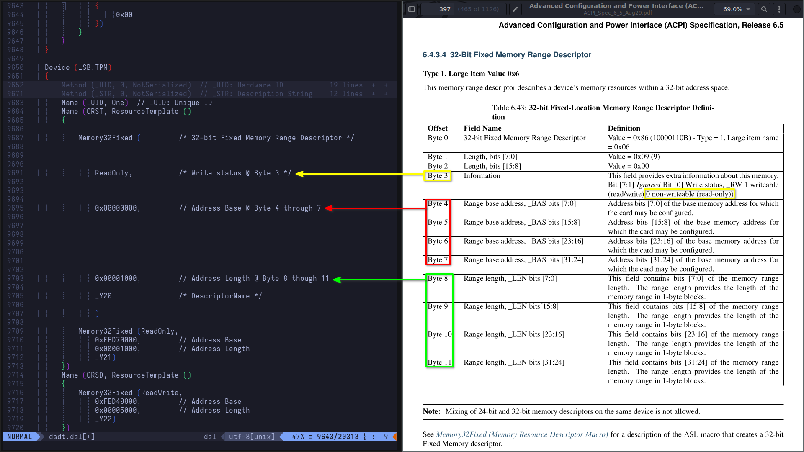
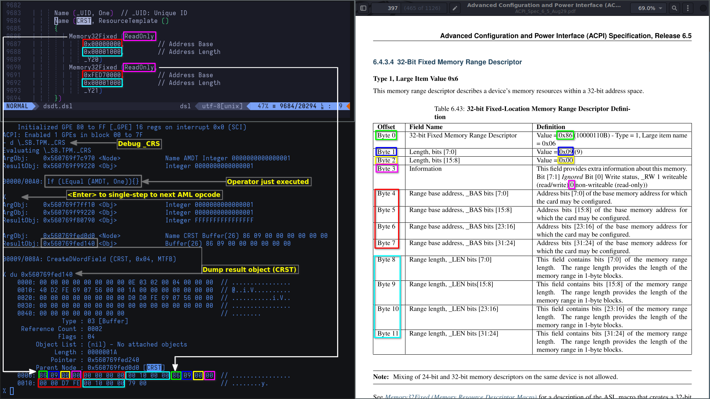
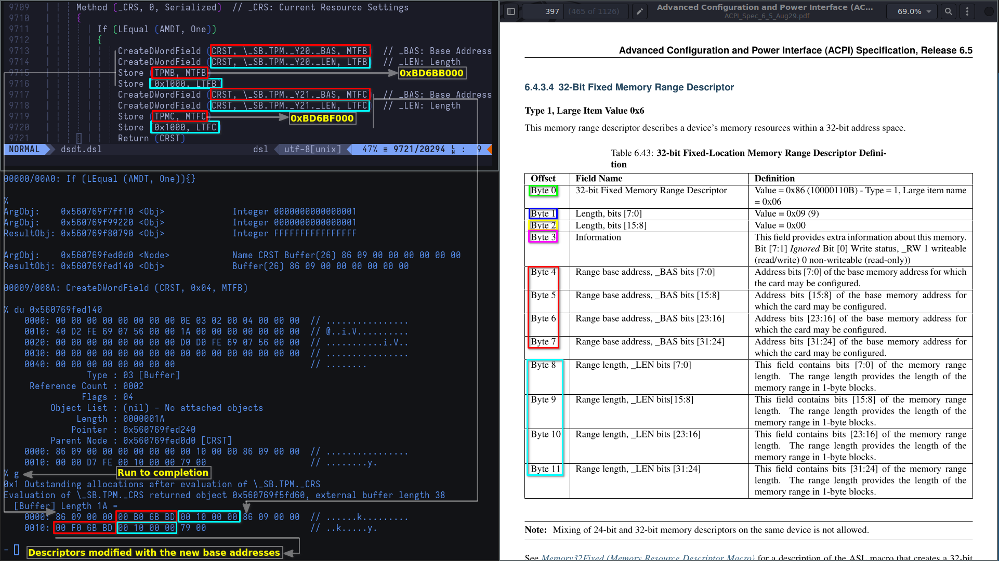

# AML Debug

## Referencing the ACPI specification

As for the `_CRS` object, the code inside it executes at runtime. So, really, the initial memory description of the device is short lived, relatively speaking. To really understand what's happening in this control method, we're gonna find it useful to bring back an old friend; `acpiexec`. Before we do that, however, let's put the theory in perspective, using the ACPI spec as a reference



As per the screenshot, Memory32Fixed is buffer, or a byte stream, consisting of 12 bytes that describe the device's memory resources within the 32-bit address space[^1]

Strap in, for this is gonna get real serious real quick! We're gonna go above and beyond with this one, and it's going to involve ~~surgery~~ a whole lot of debugging; fun!

## Debugging AML with `acpiexec`

At this point, we should already have the compiled AML DSDT. We'll dive right in. Since we already know the namespace, device, and method, we can start debugging right away. Alternatively, we can execute `- find TPM`, or `- find _CRS`. The downside to the latter is that it will find all objects that have Current Resource Settings. Spoiler alert: they're definitely more than 5. To debug, we can execute `- de \_SB.TPM._CRS` (shorthand/truncated commands are supported down to a single character, but I prefer using 2 or sometimes 3 for disambiguity. Commands are also case-insensitive). Here's a list of commands and aliases we can commonly use for quick debugging:

- `debug` => `d` or `de` (single-step a control method)
- `dump` => `du` (display ACPI objects or memory)
- `<Enter>` (single-step next AML opcode (over calls)
- `evaluate` or `execute` => `e` or `ex` (evaluate object or control method)

We'll start by loading the compiled `dsdt.aml` table using `$ acpiexec -di dsdt.aml`, followed by debugging the `_CRS` object by executing `% d \_SB.TPM._CRS`. Next, we'll single-step AML opcodes by hitting `<Enter>`, and occasionally dump `ResultObj` using `% du <Address>` where `<Address>` is the object's address (e.g. `0x560769fed140`). In the following screenshot, we are doing just that; debugging the control method, single-stepping one AML opcode, and dumping the result buffer which is the 32-bit fixed memory range descriptor

_Note: `$` refers to the low-privilege user's default shell; `%` refers to the AML debugger_



We can clearly see the memory descriptor's initial value, with all the bytes described in the specification. Let's try to visualize it

```
# Initial resource settings for the TPM device

+-------+-------+-------+-------+-------+-------+-------+-------+-------+-------+--------+--------+
| 86    | 09    | 00    | 00    | 00    | 00    | 00    | 00    | 00    | 10    | 00     | 00     |
| ^^~~~ | ^^~~~ | ^^~~~ | ^^~~~ | ^^~~~ | ^^~~~ | ^^~~~ | ^^~~~ | ^^~~~ | ^^~~~ | ^^~~~~ | ^^~~~~ |--> _Y20 Descriptor
| Byte0 | Byte1 | Byte2 | Byte3 | Byte4 | Byte5 | Byte6 | Byte7 | Byte8 | Byte9 | Byte10 | Byte11 |
+-------+-------+-------+-------+-------+-------+-------+-------+-------+-------+--------+--------+
  \---+   \---+   \---+   \---+   \---+   \---+   \---+   \---+   \---+   \---+   \----+   \----+
      |       |       |       |       |       |       |       |       |       |        |        +----> Byte11: Range length, _LEN bits [31:24] -----------+
      |       |       |       |       |       |       |       |       |       |        +-------------> Byte10: Range length, _LEN bits [23:16] -----------+
      |       |       |       |       |       |       |       |       |       +----------------------> Byte9:  Range length, _LEN bits [15:8] ------------+
      |       |       |       |       |       |       |       |       +------------------------------> Byte8:  Range length, _LEN bits [7:0] -------------+
      |       |       |       |       |       |       |       +--------------------------------------> Byte7:  Range base address, _BAS bits [31:24] --+  |
      |       |       |       |       |       |       +----------------------------------------------> Byte6:  Range base address, _BAS bits [23:16] --+  |
      |       |       |       |       |       +------------------------------------------------------> Byte5:  Range base address, _BAS bits [15:8] ---+  |
      |       |       |       |       +--------------------------------------------------------------> Byte4:  Range base address, _BAS bits [7:0] ----+  |
      |       |       |       +----------------------------------------------------------------------> Byte3:  Information                             |  |
      |       |       +------------------------------------------------------------------------------> Byte2:  Length, bits [15:8]                     |  |
      |       +--------------------------------------------------------------------------------------> Byte1:  Length, bits [7:0]                      |  |
      +----------------------------------------------------------------------------------------------> Byte0:  32-bit Fixed Memory Range Descriptor    |  |
                                                                                                                                                       |  |
                                  |........0x00000000.........|<---------------------------------------------------------------------------------------+  |
                                                                                                                                                          |
                                                                  |.........0x00001000..........|<--------------------------------------------------------+


+-------+-------+-------+-------+-------+-------+-------+-------+-------+-------+--------+--------+
| 86    | 09    | 00    | 00    | 00    | 00    | D7    | FE    | 00    | 10    | 00     | 00     |
| ^^~~~ | ^^~~~ | ^^~~~ | ^^~~~ | ^^~~~ | ^^~~~ | ^^~~~ | ^^~~~ | ^^~~~ | ^^~~~ | ^^~~~~ | ^^~~~~ |--> _Y21 Descriptor
| Byte0 | Byte1 | Byte2 | Byte3 | Byte4 | Byte5 | Byte6 | Byte7 | Byte8 | Byte9 | Byte10 | Byte11 |
+-------+-------+-------+-------+-------+-------+-------+-------+-------+-------+--------+--------+
  \---+   \---+   \---+   \---+   \---+   \---+   \---+   \---+   \---+   \---+   \----+   \----+
      |       |       |       |       |       |       |       |       |       |        |        +----> Byte11: Range length, _LEN bits [31:24] -----------+
      |       |       |       |       |       |       |       |       |       |        +-------------> Byte10: Range length, _LEN bits [23:16] -----------+
      |       |       |       |       |       |       |       |       |       +----------------------> Byte9:  Range length, _LEN bits [15:8] ------------+
      |       |       |       |       |       |       |       |       +------------------------------> Byte8:  Range length, _LEN bits [7:0] -------------+
      |       |       |       |       |       |       |       +--------------------------------------> Byte7:  Range base address, _BAS bits [31:24] --+  |
      |       |       |       |       |       |       +----------------------------------------------> Byte6:  Range base address, _BAS bits [23:16] --+  |
      |       |       |       |       |       +------------------------------------------------------> Byte5:  Range base address, _BAS bits [15:8] ---+  |
      |       |       |       |       +--------------------------------------------------------------> Byte4:  Range base address, _BAS bits [7:0] ----+  |
      |       |       |       +----------------------------------------------------------------------> Byte3:  Information                             |  |
      |       |       +------------------------------------------------------------------------------> Byte2:  Length, bits [15:8]                     |  |
      |       +--------------------------------------------------------------------------------------> Byte1:  Length, bits [7:0]                      |  |
      +----------------------------------------------------------------------------------------------> Byte0:  32-bit Fixed Memory Range Descriptor    |  |
                                                                                                                                                       |  |
                                  |........0xFED70000.........|<---------------------------------------------------------------------------------------+  |
                                                                                                                                                          |
                                                                  |.........0x00001000..........|<--------------------------------------------------------+

                                                                                                   +------------------------------------------------------+
                                                                                                   | 86 09 00 00 00 00 00 00 00 10 00 00: _Y20 Descriptor |
                                                                                                   | 86 09 00 00 00 00 D7 FE 00 10 00 00: _Y21 Descriptor |
                                                                                                   | 79 00                              : End Tag         |
                                                                                                   +------------------------------------------------------+
```

_Note: End Tag is a small resource data type. It consists of two bytes; 0x79 at Byte 0, and a checksum at Byte 1 covering all resource data after the serial identifier. The latter is automatically generated by the compiler and produces a zero sum_[^2]

So what does any of this mean? And why do we need not one, but _two_ memory range descriptors? What are `TPMB` and `TPMC`? Soon, we'll find out that those two will be the base addresses for the command and response buffers, respectively. Let's see that in action by allowing the control method to run to completion by executing `% g` or `% go`



I've chosen to skip over single-stepping for brevity, but you should get the point by now. To sum it up, here's how the resource settings change over each step

```
+----------------------+-----------------------------------------+-----------------------------------------+---------+----------------------------------+
|        OPERATOR      |              COMMAND BUFFER             |             RESPONSE BUFFER             | END TAG |           DESCRIPTION            |
+----------------------+-----------------------------------------+-----------------------------------------+---------+----------------------------------+
| Memory32Fixed (_Y20) |  86 09 00 00  00 00 00 00  00 10 00 00  |  86 09 00 00  00 00 D7 FE  00 10 00 00  |  79 00  |  // _Y20: initial allocation     |
| Memory32Fixed (_Y21) |  86 09 00 00  00 00 00 00  00 10 00 00  |  86 09 00 00  00 00 D7 FE  00 10 00 00  |  79 00  |  // _Y21: initial allocation     |
| Store (TPMB,   MTFB) |  86 09 00 00 [00 B0 6B BD] 00 10 00 00  |  86 09 00 00  00 00 D7 FE  00 10 00 00  |  79 00  |  // Command  buffer _BAS changed |
| Store (0x1000, LTFB) |  86 09 00 00  00 B0 6B BD [00 10 00 00] |  86 09 00 00  00 00 D7 FE  00 10 00 00  |  79 00  |  // Command  buffer _LEN changed |
| Store (TPMC,   MTFC) |  86 09 00 00  00 B0 6B BD  00 10 00 00  |  86 09 00 00 [00 F0 6B BD] 00 10 00 00  |  79 00  |  // Response buffer _BAS changed |
| Store (0x1000, LTFC) |  86 09 00 00  00 B0 6B BD  00 10 00 00  |  86 09 00 00  00 F0 6B BD [00 10 00 00] |  79 00  |  // Response buffer _LEN changed |
+----------------------+-----------------------------------------+-----------------------------------------+---------+----------------------------------+
```

Here's what we know so far:

- Two firmware bugs
- One byte missing from the command response buffer
- Each buffer is allocated 0x1000 (4095 bytes) in its respective ACPI region

We'll take a closer look at the driver's source code in the next subchapter, ultimately landing us into debugging the kernel dynamically so we have:

1. reference, context, and understanding before the fact (i.e. before debugging)
2. knowledge of what exactly we'll be looking for

[^1]: [32-Bit Fixed Memory Range Descriptor](https://uefi.org/specs/ACPI/6.5/06_Device_Configuration.html#bit-fixed-memory-range-descriptor)

[^2]: [End Tag](https://uefi.org/specs/ACPI/6.5/06_Device_Configuration.html#end-tag)
