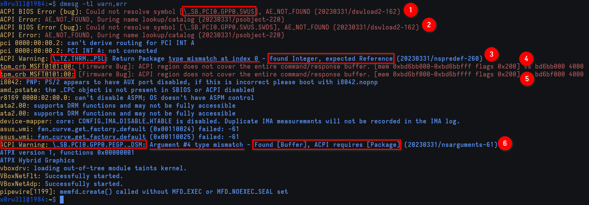

# Beginning the hunt

## What you'll need

- [Advanced Configuration and Power Interface (ACPI) Specification Version 6.5](https://uefi.org/specs/ACPI/6.5/index.html)  [^1]
- Debian-based Linux distro; I am using the [64-bit Kali Linux Installer image](https://www.kali.org/get-kali/#kali-platforms)  [^2]
- [Linux Kernel stable release (6.6.8 at the time of writing)](https://git.kernel.org/pub/scm/linux/kernel/git/stable/linux.git/tree/?h=v6.6.8)  [^3]
- ASUS TUF FX505DU
- Time
- Patience
- Lots and lots of reading
- Experience with compilation

## Installing dependency requirements for ACPI stuff

```sh
$ sudo apt install acpica-tools cpio acpi
```

## So, where do I begin?

The first place to start looking is the kernel ring buffer, aka `dmesg`. Ideally, we want to go through the output line by line to get a sense of the functional flow. It can be daunting at first, but the more you dig into it (i.e. going through the kernel source code and docs for reference), the easier and quicker it is to read and figure out

There are multiple ways to go about this: we can either look for <u>specific</u> levels, or use grep. We are going to use both, and that's because we might miss the bigger picture if we only look at scoped specifics

To start, we'll only look for two message levels; warning and error messages

```
$ dmesg -tl warn,err
ACPI BIOS Error (bug): Could not resolve symbol [\_SB.PCI0.GPP0.SWUS], AE_NOT_FOUND (20230331/dswload2-162)
ACPI Error: AE_NOT_FOUND, During name lookup/catalog (20230331/psobject-220)
ACPI BIOS Error (bug): Could not resolve symbol [\_SB.PCI0.GPP0.SWUS.SWDS], AE_NOT_FOUND (20230331/dswload2-162)
ACPI Error: AE_NOT_FOUND, During name lookup/catalog (20230331/psobject-220)
ACPI Warning: \_TZ.THRM._PSL: Return Package type mismatch at index 0 - found Integer, expected Reference (20230331/nspredef-260)
tpm_crb MSFT0101:00: [Firmware Bug]: ACPI region does not cover the entire command/response buffer. [mem 0xbd6bb000-0xbd6bbfff flags 0x200] vs bd6bb000 4000
tpm_crb MSFT0101:00: [Firmware Bug]: ACPI region does not cover the entire command/response buffer. [mem 0xbd6bf000-0xbd6bffff flags 0x200] vs bd6bf000 4000
ACPI Warning: \_SB.PCI0.GPP0.PEGP._DSM: Argument #4 type mismatch - Found [Buffer], ACPI requires [Package] (20230331/nsarguments-61)
```



As we can see, we've already got ourselves a handful of potential issues. One thing to keep in mind about ACPI is that, for the end-user, there usually isn't much they can do without really digging into it. Nothing super drastic is going to happen with broken ACPI; the kernel does a lot of heavy-lifting under the hood to accommodate for old/broken BIOS. In theory, the laptop still runs _fine_. It might not be the greatest thing ever, but it's fully functional. Now, this output has been annoying me since 2019, and it's about time I did something about it

Let's try to unpack what we've got so far:
- `Could not resolve symbol [\_SB.PCI0.GPP0.SWUS], AE_NOT_FOUND`: a symbol was not found in any of the ACPI tables, specifically the `SWUS` Device object in this instance
- `\_TZ.THRM._PSL: Return Package type mismatch at index 0 - found Integer, expected Reference`: control method was expected to return a `Reference` object, but instead returned an `Integer`
- `ACPI region does not cover the entire command/response buffer. [mem 0xbd6bb000-0xbd6bbfff flags 0x200] vs bd6bb000 4000`: this error is TPM-related, and it means that the command/response buffer is bigger than what the ACPI region covers (ACPI covers 0x1000 (4095 bytes) as opposed to the expected 0x4000 (16384 bytes))
- `\_SB.PCI0.GPP0.PEGP._DSM: Argument #4 type mismatch - Found [Buffer], ACPI requires [Package]`: similar to the type mismatch warning above, except this time, the `PEGP` Device-Specific Method expected a `Package` object for argv4, whereas a `Buffer` object was passed instead

In the next section, we are going to get down to business; we are going to dump ACPI tables, disassemble them, and go through the ASL code

[^1]: We might also glance over [ACPI Specification Version 5.0](https://uefi.org/sites/default/files/resources/ACPI_5_0_Errata_B.pdf)

[^2]: Personal preference; choice of distro is all yours

[^3]: [Minimal requirements to compile the Kernel](https://www.kernel.org/doc/html/latest/process/changes.html)
