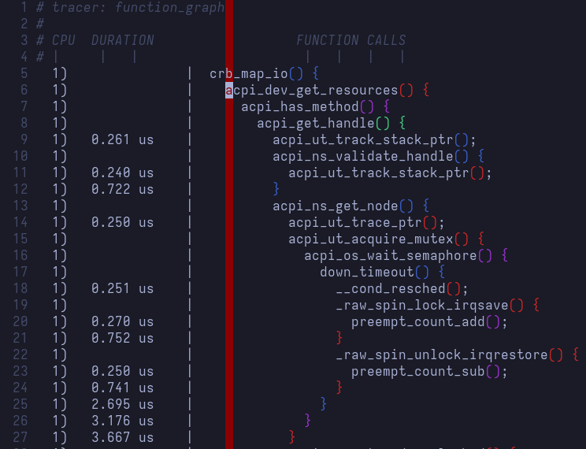
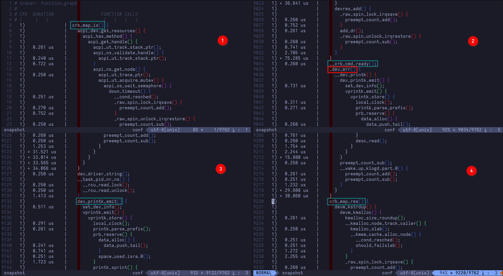
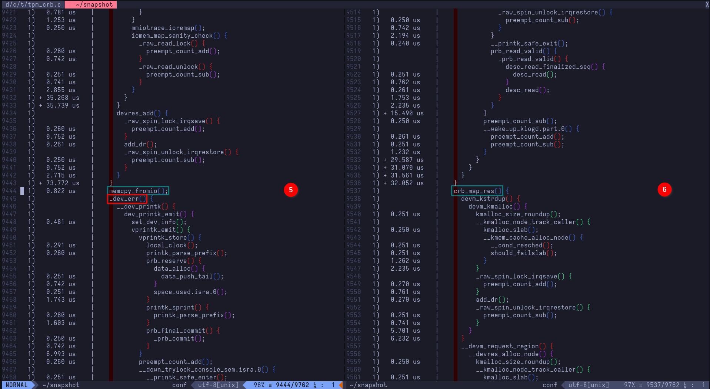
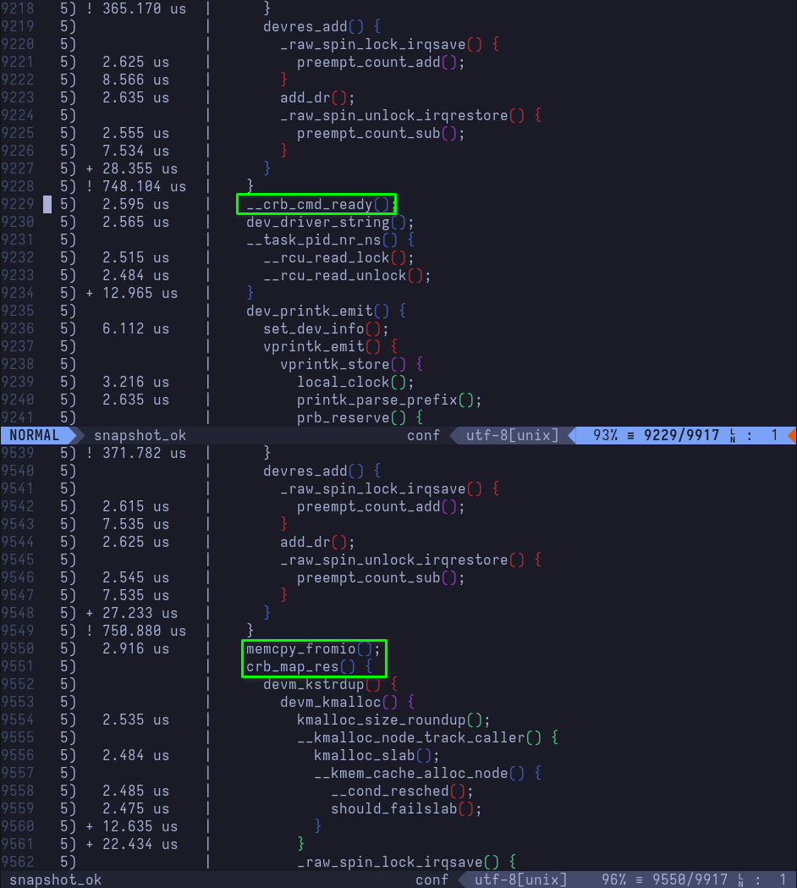
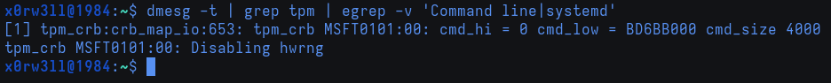

# Dynamic Debug

## Requirements

### Kernel build

For this part, we'll be performing dynamic debugging, which requires the kernel to be built with the following kernel config items[^1]

```
CONFIG_DYNAMIC_DEBUG=y        # build catalog, enables CORE
CONFIG_DYNAMIC_DEBUG_CORE=y   # enable mechanics only, skip catalog
```

### Kernel boot parameters

In the dynamic debug documentation referenced above, we can find all the information pertinent to setting up filters. Let's first start by searching the available function filters to find out whether or not we can debug the function we're interested. Every prompt shown from hereon out is assumed to be running as root

```sh
$ grep crb_map_io /sys/kernel/tracing/available_filter_functions
crb_map_io
```

Great! Looks like we can indeed debug that function. Let's go ahead and prepare the kernel parameters for dynamic debugging at boot-time

```sh
dyndbg="file tpm_crb.c +p" trace_buf_size=1M ftrace=function_graph ftrace_graph_filter=crb_map_io ftrace_boot_snapshot
```

Those parameters can be passed into your bootloader's configs; be it GRUB's `/etc/default/grub` (don't forget to `update-grub` after making changes to the file), or systemd-boot's `/boot/efi/loader/entries/<machine-id>-$(uname -r).conf`

I chose the `function_graph` tracer specifically because it's easier to follow from a strictly visual standpoint. `ftrace_graph_filter=crb_map_io` will only trace that one function in the `tpm_crb.c` file; this is extremely important so the tracer does not hook into every function that's executing (might severely degrade performance and/or cause lockups). `ftrace_boot_snapshot` will allow the tracer to hand over the call graph to the filesystem, which we will be using a text editor to view its contents at `/sys/kernel/tracing/snapshot`. Finally, the `+p` flag following the file match-spec enables the `pr_debug()` callsite. We are using it to see debug messages that would be otherwise hidden as per the kernel's default parameters

## Post-reboot Analysis

After having committed our changes to the kernel command-line parameters and rebooted the system, it's time to analyze the function call graph. In Vim's command mode, we'll be executing the following: `:set cc=25`, and `:hi ColorColumn guibg=DarkRed`. This is simply to overlay a color column at the 25th column exactly; this is the level at which any function executing within `crb_map_io` is displayed in the call graph



Now, this is an almost-10k-lines-long file, so we'll only be covering relevance as usual. As a reminder, we are looking for functions in the following order

```
1. crb_map_io()
2. __crb_cmd_ready()
3. _dev_err()
4. dev_printk_emit()
5. crb_map_res()
6. memcpy_fromio()
7. _dev_err()
8. crb_map_res()
```

I chose to split the same file multiple times in Vim so it's easier to follow. Normally, we'd be scrolling through/searching for the functions of interest. I also darkened the ColorColumn so it doesn't impact readability



Let's unpack:

1. `crb_map_io()` begins execution. This is the function we're tracing
2. \
2.1 `__crb_cmd_ready()` executes, requesting tpm crb device to enter ready state\
2.2 `_dev_err()` executes (it's really a wrapper for printing device error-level messages), calling `__dev_printk()`, which ultimately ends up printing `[Firmware Bug]: ACPI region does not cover the entire command/response buffer. [mem 0xbd6bb000-0xbd6bbfff flags 0x200] vs bd6bb000 4000` to the kernel ring buffer. Remember, this is the called by the <u>first</u> call to `crb_fixup_cmd_size()` which handles fixing up the command size
3. `dev_printk_emit()` executes, printing the `dev_dbg` message `tpm_crb MSFT0101:00: cmd_hi = 0 cmd_low = BD6BB000 cmd_size 1000` to the kernel ring buffer
4. `crb_map_res()` executes, mapping the **<u>command</u>** response buffer's resources



5. \
5.1 `memcpy_fromio()` executes, copying memory area from IO for the response buffer\
5.2 `_dev_err()` executes, calling `__dev_printk()`, which ultimately ends up printing `[Firmware Bug]: ACPI region does not cover the entire command/response buffer. [mem 0xbd6bf000-0xbd6bffff flags 0x200] vs bd6bf000 4000` to the kernel ring buffer. Remember, this is the called by the <u>second</u> call to `crb_fixup_cmd_size()` which handles fixing up the response size
3. `crb_map_res()` executes, mapping the command **<u>response</u>** buffer's resources

Now, putting it all together, we have perspective

```
tpm_crb MSFT0101:00: [Firmware Bug]: ACPI region does not cover the entire command/response buffer. [mem 0xbd6bb000-0xbd6bbfff flags 0x200] vs bd6bb000 4000

tpm_crb MSFT0101:00: cmd_hi = 0 cmd_low = BD6BB000 cmd_size 1000

tpm_crb MSFT0101:00: [Firmware Bug]: ACPI region does not cover the entire command/response buffer. [mem 0xbd6bf000-0xbd6bffff flags 0x200] vs bd6bf000 4000
```

It all makes sense now! Command size is 1000 (remember: `Store (0x1000, LTFB)`) as declared/modified by ACPI, versus what the register reports back; 4000. Now, if you think the fix should be simple enough, you're on the right track. Instead of allocating 0x1000 (4.00 KiB) for the command and response buffers, we should really allocate 0x4000 (16.00 KiB). Let's go ahead and modify that in DSDT's `_SB.TPM._CRS` (or `_SB.TPM.CRST` and remove runtime modifications executed in `_SB.TPM._CRS`)

## The Fix

```diff
Method (_CRS, 0, Serialized)  // _CRS: Current Resource Settings
{
    If (LEqual (AMDT, One))
    {
        CreateDWordField (CRST, \_SB.TPM._Y20._BAS, MTFB)  // _BAS: Base Address
        CreateDWordField (CRST, \_SB.TPM._Y20._LEN, LTFB)  // _LEN: Length
        Store (TPMB, MTFB)
-       Store (0x1000, LTFB)
+       Store (0x4000, LTFB)    /* Fix up command size */
        CreateDWordField (CRST, \_SB.TPM._Y21._BAS, MTFC)  // _BAS: Base Address
        CreateDWordField (CRST, \_SB.TPM._Y21._LEN, LTFC)  // _LEN: Length
        Store (TPMC, MTFC)
-       Store (0x1000, LTFC)
+       Store (0x4000, LTFC)    /* Fix up response size */
        Return (CRST)
    }
```

Bump the OEMRevision, compile the newly modified table, copy the compiled table into `kernel/firmware/acpi`, create the cpio archive, copy it over to `/boot/efi/EFI/acpi/acpi.cpio`, and reboot. With dynamic debugging still enabled, we can verify whether or not our fix actually worked. Grepping the kernel ring buffer for the firmware bug will not return anything. Grepping for `cmd_size`, however, will now show `tpm_crb MSFT0101:00: cmd_hi = 0 cmd_low = BD6BB000 cmd_size 4000`! Looking at the new `/sys/kernel/tracing/snapshot` will reveal that `_dev_err()` calls were never made (`_dev_err()` is the byproduct of calling `crb_fixup_cmd_size()` to print the error-level message)



</br>



This concludes addressing TPM! We've not only managed to address an issue at a lower level, but we've also learned a bit of debugging along the way

[^1]: [Kernel Configuration](https://www.kernel.org/doc/html/latest/admin-guide/dynamic-debug-howto.html#kernel-configuration)
