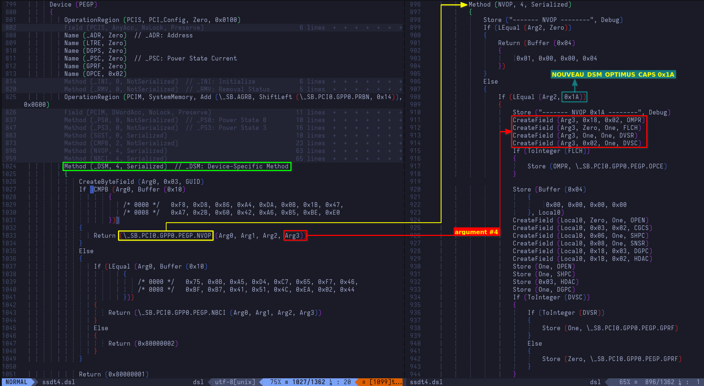
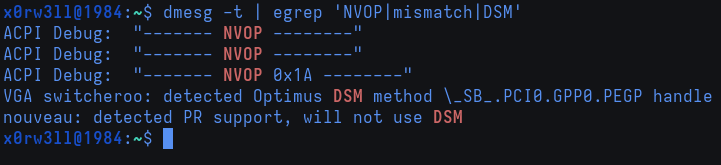
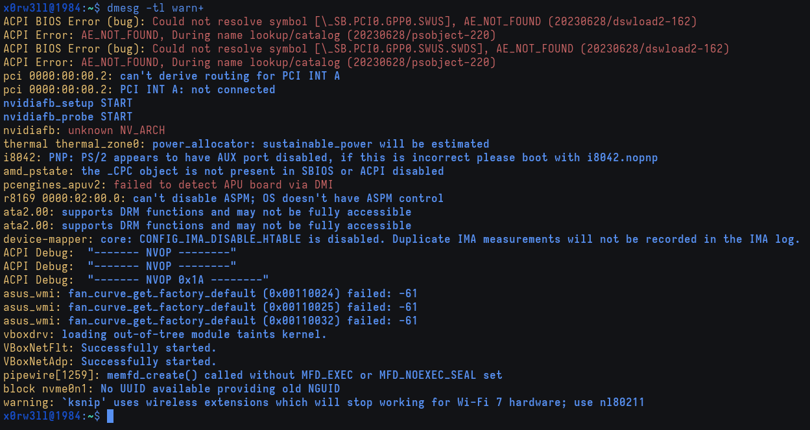

# Part 2: ACPI

We'll kick this part off by looking at `\_SB.PCI0.GPP0.PEGP._DSM` and subsequently `\_SB.PCI0.GPP0.PEGP.NVOP` side by side



The Device-Specific Method compares buffers `(CMPB (Arg0, Buffer ...))`, and calls `NVOP` with 4 arguments, returning the buffer it returns upon successful execution back to the caller (`nouveau_optimus_dsm`). Remember, ACPI complained with a <u>warning</u>, not an error, meaning that it probably still processed the input buffer even when it was expecting a package. This is important to keep in mind because the way `NVOP` is currently set up handles buffer objects just fine

```
/* Also remember that Arg3 is argument #4 beginning at index 0 */

CreateField (Arg3, 0x18, 0x02, OMPR)
CreateField (Arg3, Zero, One, FLCH)
CreateField (Arg3, One, One, DVSR)
CreateField (Arg3, 0x02, One, DVSC)
```

So if we're sending a package containing one element that's a buffer object, we need to dereference that object reference[^1]. The idea is very simple, and you already know the concept. Consider a list `x` containing `['A', 'B', 'C']`. If we want to dereference the first item of the list, we can do that by using its index; `x[0] = 'A'`. This is exactly what we'll be doing here, so let's see the diff in action

```diff
- CreateField (Arg3, 0x18, 0x02, OMPR)
- CreateField (Arg3, Zero, One, FLCH)
- CreateField (Arg3, One, One, DVSR)
- CreateField (Arg3, 0x02, One, DVSC)

+ CreateField (DerefOf (Arg3 [Zero]), 0x18, 0x02, OMPR)
+ CreateField (DerefOf (Arg3 [Zero]), Zero, One, FLCH)
+ CreateField (DerefOf (Arg3 [Zero]), One, One, DVSR)
+ CreateField (DerefOf (Arg3 [Zero]), 0x02, One, DVSC)
```

Fairly straightforward if you ask me! Without this change, an error would get thrown because then there would be a wildly different data types (package vs buffer). After compiling the table, creating the cpio archive, and all that fun stuff, we no longer get the type mismatch warning! Additionally, this fix makes it so that we're compliant to the spec where ACPI's concerned



</br>



Success! This concludes addressing nouveau both on the ACPI and kernel driver sides. I hope you enjoyed it as much as I did, and learned a thing or two while you're at it. This has been an extremely valuable experience for me in that I learned so much in so little time by consulting various resources, trying out things, and correlating findings. I do hope that this inspires more research into lower-level components/subsystems that are usually ripe for research!

[^1]: [DerefOf (Dereference an Object Reference)](https://uefi.org/specs/ACPI/6.5/19_ASL_Reference.html#derefof-dereference-an-object-reference)
