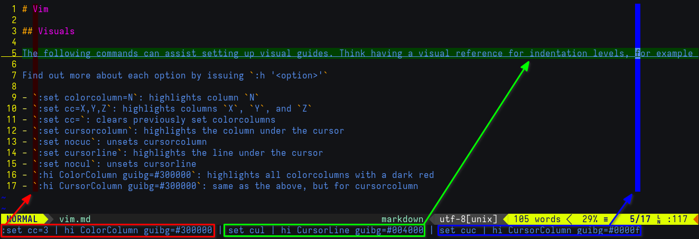

# VIM

## Visuals

The following commands can assist setting up visual guides. Think having a visual reference for indentation levels, for example

Find out more about each option by issuing `:h '<option>'`

- _(Ex-mode)_ `:set colorcolumn=N`: highlights column `N`
- _(Ex-mode)_ `:set cc=X,Y,Z`: highlights columns `X`, `Y`, and `Z`
- _(Ex-mode)_ `:set cc=`: clears previously set colorcolumns
- _(Ex-mode)_ `:set cursorcolumn`: highlights the column under the cursor
- _(Ex-mode)_ `:set nocuc`: unsets cursorcolumn
- _(Ex-mode)_ `:set cursorline`: highlights the line under the cursor
- _(Ex-mode)_ `:set nocul`: unsets cursorline
- _(Ex-mode)_ `:hi ColorColumn guibg=#300000`: highlights all colorcolumns with a dark red
- _(Ex-mode)_ `:hi CursorColumn guibg=#300000`: same as the above, but for cursorcolumn

## Movement

- _(NORMAL)_ `3w`: jump 3 words forward (cursor is placed at the beginning of the Nth word)
- _(NORMAL)_ `5b`: jump 5 words backward
- _(NORMAL)_ `gg`: jump to top (file)
- _(NORMAL)_ `G`: jump to bottom (file)
- _(NORMAL)_ `zz`: position line under the cursor at the middle of the screen
- _(Ex-mode)_ `:N`: jump to line #`N`
- `$ vim <file> +N`: open `<file>` placing the cursor at line `N`

## Splitting

- _(Ex-mode)_ `:sp <file>`: open `<file>` in a horizontally-split window
- _(Ex-mode)_ `:term`: open a terminal in a horizontally-split window
- _(Ex-mode)_ `:vsp <file>`: open `<file>` in a vertically-split window
- _(Ex-mode)_ `:vert term`: open a terminal in a vertically-split window

## Text manipulation

- _(Ex-mode)_ `:4,12s/replace_me/replaced/g`: replace all (`/g`) instances of `replace_me` in lines 4 through 12 with `replaced`
- _(Ex-mode)_ `:50,100d`: delete lines 50 through 100
- _(NORMAL)_ `dd`: delete entire line under cursor
- _(NORMAL)_ `yy`: yank (copy) entire line under cursor

## Misc

- `$ vim -x <file>`: create a blowfish2-encrypted `<file>`
- _(Ex-mode)_ `:tabnew <file>`: open `<file>` in a new tab
- _(NORMAL)_ `Shift+K`: view API reference for the function under the cursor (if supported/found)
- _(NORMAL)_ `gt`: go to next tab
- _(NORMAL)_ `m<char>`: set a mark using `char`. Example: `ma` sets a mark for the letter `a`
- _(NORMAL)_ `'<char>`: jump to mark `char`. Example: `'a` jump to mark `a`
- _(NORMAL)_ `ZZ`: quit, saving changes
- _(NORMAL)_ `ZQ`: quit without saving

